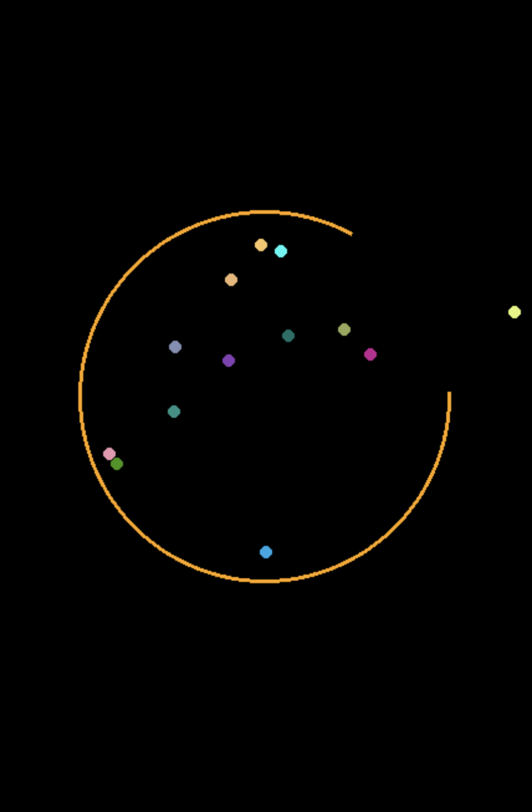
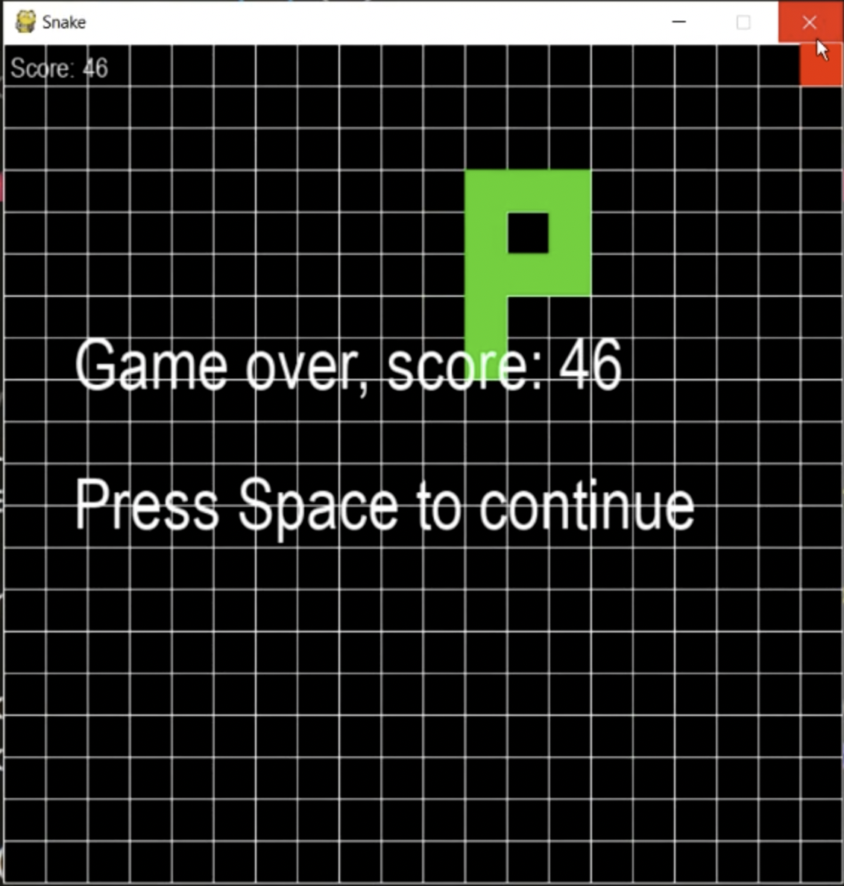
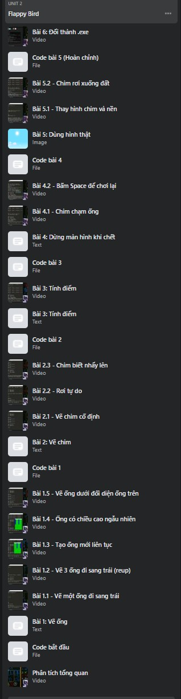

## Python Programming Projects for Beginners

This repositories contains source code used in my coding tutorials ([English channel](https://youtube.com/@laiprogramming), [Vietnamese channel](https://youtube.com/dunglailaptrinh))

[Bouncing Balls Program](https://github.com/laiprogramming/laiprogramming/tree/main/bouncing_balls)

[Snake Game](https://github.com/laiprogramming/laiprogramming/tree/main/snake_game)

[Flappy Bird Game](https://github.com/laiprogramming/laiprogramming/tree/main/flappy_bird)

