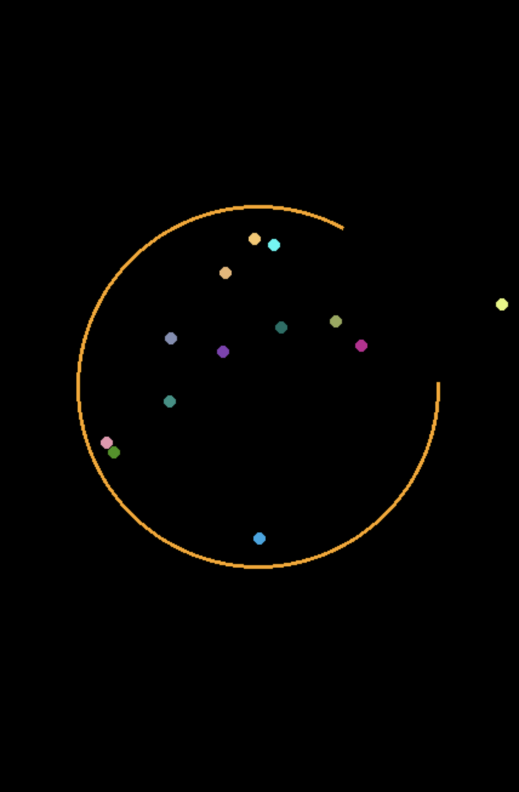

## Python Programming Projects for Beginners

This repositories contains source code used in videos from [Lai Programming Youtube Channel](https://youtube.com/@laiprogramming)

1. [Bouncing Balls Program](https://github.com/laiprogramming/laiprogramming/tree/main/bouncing_balls)

