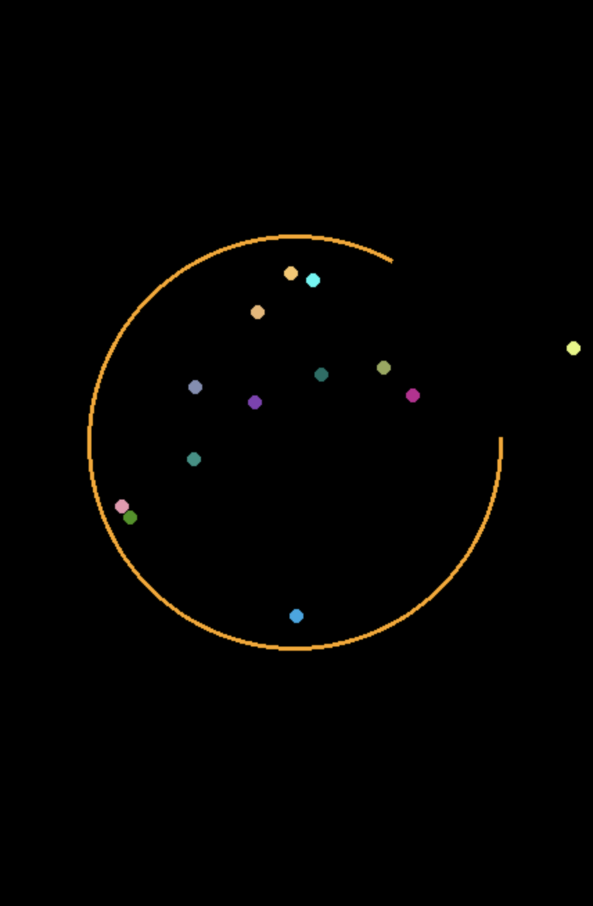

# Bouncing Balls Program

### [Watch Full Tutorial in English](https://youtu.be/W9fdczla2ds)
### [Watch Full Tutorial in Vietnamese](https://youtu.be/sgQJWAuc_kM)

This folder contains the source code for creating a bouncing balls program, broken down into 7 steps.

### Steps Overview:

1. **Setup Pygame**  
2. **Draw Circle and Ball**
3. **Drop the Ball**
4. **Bounce the Ball**
5. **Spin the Circle**
6. **Drop Ball Out of Circle**
7. **Multiple Balls**

The final program can be found in `step7.py`.

### Requirements

- **Python 3**
- **Pygame** and **NumPy** libraries

To run the code, make sure you have both libraries installed.
