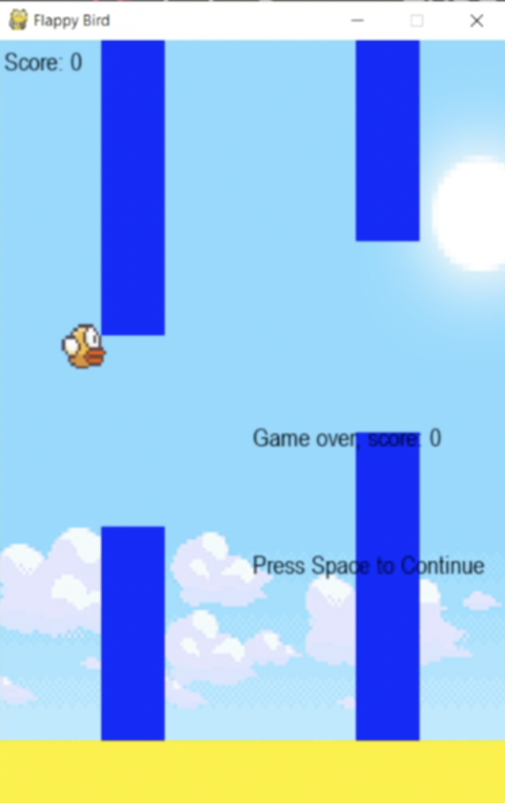

# Flappy Bird Game

### [Watch Full Tutorial in Vietnamese](https://youtu.be/-DkLFGuZMDo)

This folder contains the source code for creating a snake game in python, broken down into 7 steps.

The final program can be found in `code_flappy_5.py`.

### Requirements

- **Python 3**
- **Pygame** libraries

To run the code, make sure you have both libraries installed.

